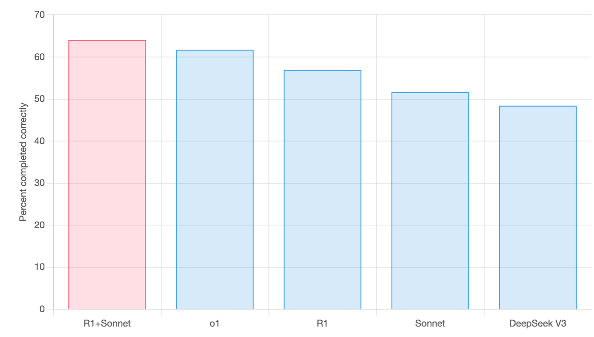
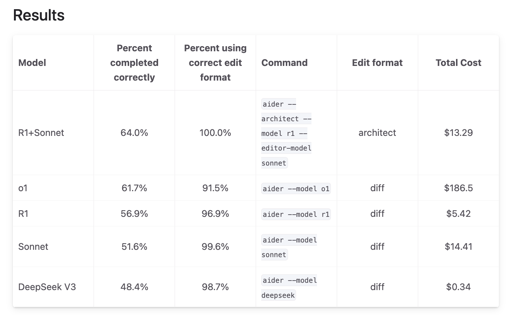

<div align="center">

<h1>DeepClaude_Benchmark 🐬🧠</h1>


This project is designed to evaluate the effectiveness of DeepClaude and other combination models, mainly using aider benchmarks. In the future, if there is energy, other benchmarks will be introduced for evaluation, such as assessing the creative ability of DeepGemini and comparing it with other models.

这个项目是用来评估deepclaude和其他组合模型的效果，主要进行aider-benchmark的评估，后续有精力会引入其他benchmark进行评估，比如评估deepgemini的创作能力和其他模型的对比。

</div>

DeepClaude是一款高性能的大语言模型推理应用程序编程接口（API），它将DeepSeek R1的思维链（CoT）推理能力与Anthropic Claude的创意和代码生成能力相结合。它提供了一个统一的接口，以便在充分利用这两种模型优势的同时，还能让用户完全掌控自己的API密钥和数据。

选择将R1和Claude结合的原因如下：
DeepSeek R1的思维链推理展示了其深度推理能力，大语言模型甚至能达到“元认知”的程度，比如自我纠正、思考极端情况，以及使用自然语言进行准蒙特卡洛树搜索。

然而，R1在代码生成、创造力和对话技巧方面存在不足。而Claude 3.5 Sonnet在这些领域表现出色，恰好能完美地弥补R1的不足。因此，DeepClaude将这两种模型结合起来。

链接：https://aider.chat/2025/01/24/r1-sonnet.html

在aider-benchmark项目中，原始评测的结果如图：


但是实际效果是怎么样呢，再加上有人使用python复现了deepclaude，复现后的代码能不能达到同样的分数，抱着这样的好奇，我花“巨资”，开始进行验证。

先放出aider官方结果的图



然后开始验证，首先是字节火山引擎的deepseek R1的结果，准确率44%，低于aider官方使用deepseek官方api的测试结果，不过以官方api现在总是不稳定的情况，应该分数会更低。官方的R1结果是56.9，percent_cases_well_formed的指标是96.4，和官方的96.9基本一致，符合误差反问，而准确率比官方低了12.9，跌出了一个deepseek v3

```
- dirname: 2025-02-22-00-51-50--a-deepseek-r1-test-220-10-1--2-1-huoshan
  test_cases: 225
  model: openai/deepseek-r1-250120
  edit_format: diff
  commit_hash: 5402ed1-dirty
  pass_rate_1: 19.6
  pass_rate_2: 44.0
  pass_num_1: 44
  pass_num_2: 99
  percent_cases_well_formed: 96.4
  error_outputs: 35
  num_malformed_responses: 10
  num_with_malformed_responses: 8
  user_asks: 13
  lazy_comments: 0
  syntax_errors: 0
  indentation_errors: 0
  exhausted_context_windows: 0
  test_timeouts: 6
  total_tests: 227
  command: aider --model openai/deepseek-r1-250120
  date: 2025-02-22
  versions: 0.74.3.dev
  seconds_per_case: 659.2
  total_cost: 0.0000

costs: $0.0000/test-case, $0.00 total, $0.00 projected
```

然后开始验证国内deepclaude python版本的结果，项目链接：<a href="https://github.com/ErlichLiu/DeepClaude">国内deepclaude python版本</a>

deepseek R1字节火山引擎版本加上claude 24年10月版本，结果准确率变成了38.2，比不加claude的版本跌了5.8%，因为这个的原理，相当于将R1的思考作为输入给sonnet，所以和单用R1比就是多付了一个sonnet的钱，获得了效果的下降，但是aider都实验了，下降有些反直觉。

```
- dirname: 2025-02-23-deepclaude-try
  test_cases: 225
  model: openai/deepseek-r1-250120
  edit_format: diff
  commit_hash: 5402ed1-dirty
  pass_rate_1: 18.7
  pass_rate_2: 38.2
  pass_num_1: 42
  pass_num_2: 86
  percent_cases_well_formed: 95.1
  error_outputs: 96
  num_malformed_responses: 20
  num_with_malformed_responses: 11
  user_asks: 7
  lazy_comments: 0
  syntax_errors: 0
  indentation_errors: 0
  exhausted_context_windows: 0
  test_timeouts: 1
  total_tests: 228
  command: aider --model openai/deepseek-r1-250120
  date: 2025-02-23
  versions: 0.74.3.dev
  seconds_per_case: 298.4
  total_cost: 0.0000

costs: $0.0000/test-case, $0.00 total, $0.00 projected
```

于是我开始了修改deepclaude的官方原版代码，修改成openai的返回格式用于评测，官方项目链接为<a href="https://github.com/getasterisk/deepclaude">deepclaude官方</a>，结果正在测试中，未完待续。。。，前2次单独火山和python版本的deepclaude的完整结果会更新到src的文件夹中，可以根据对应名字查看具体数据。
