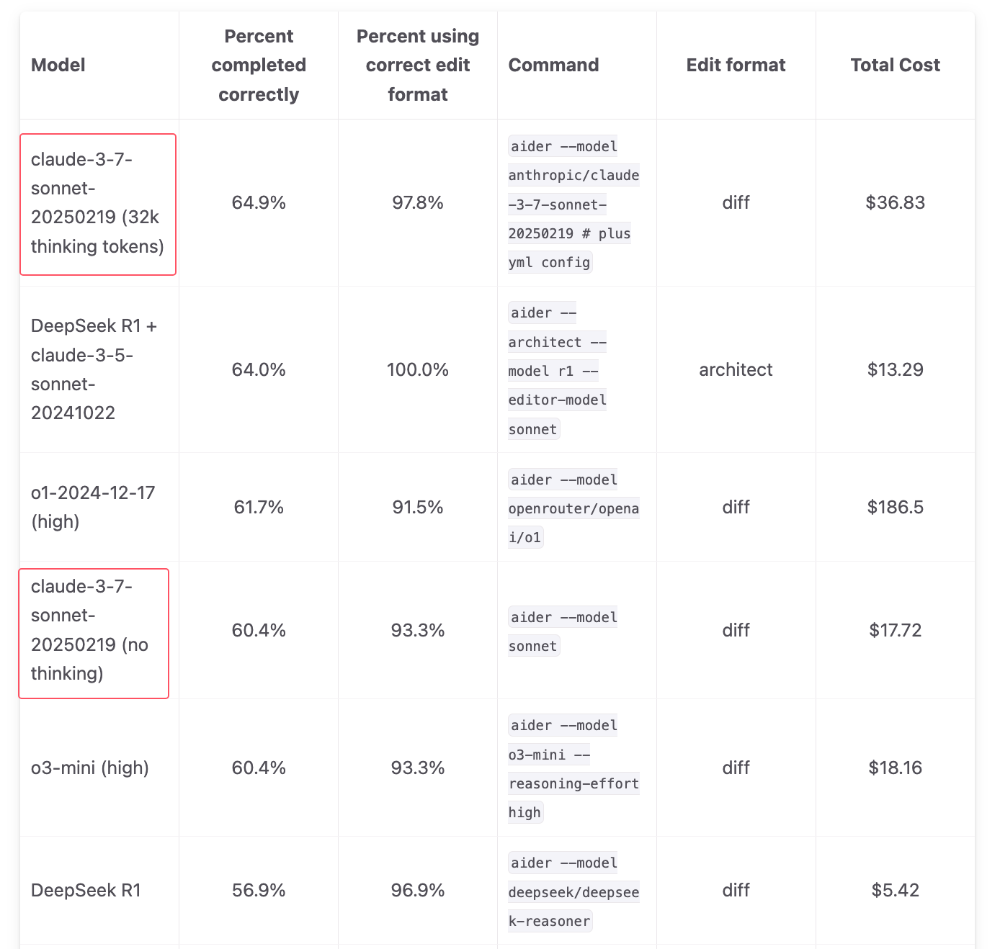

<div align="center">

<h1>DeepClaude_Benchmark 🐬🧠</h1>


This project is designed to evaluate the effectiveness of DeepClaude and other combination models, mainly using aider benchmarks. In the future, if there is energy, other benchmarks will be introduced for evaluation, such as assessing the creative ability of DeepGemini and comparing it with other models.

这个项目是用来评估deepclaude和其他组合模型的效果，主要基于deepclaude rust版本，升级支持openai格式后的<a href="https://github.com/yuanhang110/DeepClaude_Pro">deepclaude官方升级版</a>进行aider-benchmark的评估，后续有精力会引入其他benchmark进行评估，比如评估deepgemini的创作能力和其他模型的对比。

</div>

DeepClaude是一款高性能的大语言模型推理应用程序编程接口（API），它将DeepSeek R1的思维链（CoT）推理能力与Anthropic Claude的创意和代码生成能力相结合。它提供了一个统一的接口，以便在充分利用这两种模型优势的同时，还能让用户完全掌控自己的API密钥和数据。

评测需要耗费比较多的deepseek额度，有需要使用deepseek的，可以在火山填我的邀请码，参与入口：https://www.volcengine.com/experience/ark?utm_term=202502dsinvite&ac=DSASUQY5&rc=BWOJXKPS  邀请码：BWOJXKPS

链接：https://aider.chat/2025/01/24/r1-sonnet.html

在aider-benchmark项目中，原始评测的结果如图：


但是实际效果是怎么样呢，再加上有人使用python复现了deepclaude，复现后的代码能不能达到同样的分数，抱着这样的好奇，我花“巨资”，开始进行验证。

先放出aider官方结果的图


然后开始验证，首先是字节火山引擎的deepseek R1的结果，准确率44%，低于aider官方使用deepseek官方api的测试结果，不过以官方api现在总是不稳定的情况，应该分数会更低。官方的R1结果是56.9，percent_cases_well_formed的指标是96.4，和官方的96.9基本一致，符合误差，而准确率比官方低了12.9，跌出了一个deepseek v3

<details close>
<summary><strong>deepseek R1的结果：</strong></summary> 
<hr>
<pre><code>
- dirname: 2025-02-22-00-51-50--a-deepseek-r1-test-220-10-1--2-1-huoshan
  test_cases: 225
  model: openai/deepseek-r1-250120
  edit_format: diff
  commit_hash: 5402ed1-dirty
  pass_rate_1: 19.6
  pass_rate_2: 44.0
  pass_num_1: 44
  pass_num_2: 99
  percent_cases_well_formed: 96.4
  error_outputs: 35
  num_malformed_responses: 10
  num_with_malformed_responses: 8
  user_asks: 13
  lazy_comments: 0
  syntax_errors: 0
  indentation_errors: 0
  exhausted_context_windows: 0
  test_timeouts: 6
  total_tests: 227
  command: aider --model openai/deepseek-r1-250120
  date: 2025-02-22
  versions: 0.74.3.dev
  seconds_per_case: 659.2
  total_cost: 0.0000
</code></pre>
<hr>
</details>

然后开始验证国内deepclaude python版本的结果，项目链接：<a href="https://github.com/ErlichLiu/DeepClaude">国内deepclaude python版本</a>

deepseek R1字节火山引擎版本加上claude 24年10月版本，结果准确率变成了38.2，比不加claude的版本跌了5.8%，因为这个的原理，相当于将R1的思考作为输入给sonnet，所以和单用R1比就是多付了一个sonnet的钱，获得了效果的下降，但是aider都实验了，下降有些反直觉。
<details close >
<summary><strong>deepclaude python版本的结果：</strong></summary> 
<hr>
<pre><code>
- dirname: 2025-02-23-deepclaude-try
  test_cases: 225
  model: openai/deepseek-r1-250120
  edit_format: diff
  commit_hash: 5402ed1-dirty
  pass_rate_1: 18.7
  pass_rate_2: 38.2
  pass_num_1: 42
  pass_num_2: 86
  percent_cases_well_formed: 95.1
  error_outputs: 96
  num_malformed_responses: 20
  num_with_malformed_responses: 11
  user_asks: 7
  lazy_comments: 0
  syntax_errors: 0
  indentation_errors: 0
  exhausted_context_windows: 0
  test_timeouts: 1
  total_tests: 228
  command: aider --model openai/deepseek-r1-250120
  date: 2025-02-23
  versions: 0.74.3.dev
  seconds_per_case: 298.4
  total_cost: 0.0000

</code></pre>
<hr>
</details>

于是我开始了修改deepclaude的官方原版代码，修改成openai的返回格式用于评测，基于官方项目修改，支持openai格式的项目链接为<a href="https://github.com/yuanhang110/DeepClaude_Pro">deepclaude官方升级版</a>，结果测试完成，可以看到pass_rate_1从19.6提升到24.4，提升了24.5%， pass_rate_2从44.0提升到45.8，提升了4%，percent_cases_well_formed从96.4提升到97.8，可以看到官方的deepclaude项目在各方面都有提升，但是提升不如前面链：https://aider.chat/2025/01/24/r1-sonnet.html

中提升的那么大。但好歹有提升，deepclaude python版本暂时只有成本上升，没有性能提升。
<details close >
<summary><strong>deepclaude python版本的结果：</strong></summary> 
<hr>
<pre><code>
- dirname: 2025-02-24-deepclaude-rust
  test_cases: 225
  model: openai/deepseek-r1-250120
  edit_format: diff
  commit_hash: 5402ed1-dirty
  pass_rate_1: 24.4
  pass_rate_2: 45.8
  pass_num_1: 55
  pass_num_2: 103
  percent_cases_well_formed: 97.8
  error_outputs: 64
  num_malformed_responses: 5
  num_with_malformed_responses: 5
  user_asks: 51
  lazy_comments: 0
  syntax_errors: 0
  indentation_errors: 0
  exhausted_context_windows: 0
  test_timeouts: 0
  total_tests: 231
  command: aider --model openai/deepseek-r1-250120
  date: 2025-02-24
  versions: 0.74.3.dev
  seconds_per_case: 588.1
  total_cost: 0.0123

</code></pre>
<hr>
</details>

接下来开始测试sonnet3.7加上deepseek r1的效果



从aider官网最新结果可以看到claude3.7的非推理和推理模型都有很大的提升，推理模型取得了新sota，但是它需要36美元，成本是最开始的r1加sonnet 3.5的13美元的2倍多接近3倍，那么我接下来准备开始测试deepclaude3.7版本，即字节火山r1加上claude3.7的非思考版本。

它的结果如下，可以看到claude3.7加deepseek后pass_rate_2为50.7，比45.8的deepseekR1+claude3.5版本提升10.7%，比纯deepseek r1提升15.2%。成本方面deepclaude3.7低于claude3.7的非思考版本，成本约为75%。然后格式准确性，从96.4到99.1，提升了2.8%

<details close >
<summary><strong>deepclaude python版本的结果：</strong></summary> 
<hr>
<pre><code>
- dirname: 2025-02-27-deepclaude37-rust
  test_cases: 225
  model: openai/deepseek-r1-250120
  edit_format: diff
  commit_hash: 5402ed1-dirty
  pass_rate_1: 25.3
  pass_rate_2: 50.7
  pass_num_1: 57
  pass_num_2: 114
  percent_cases_well_formed: 99.1
  error_outputs: 76
  num_malformed_responses: 2
  num_with_malformed_responses: 2
  user_asks: 2
  lazy_comments: 0
  syntax_errors: 0
  indentation_errors: 0
  exhausted_context_windows: 0
  test_timeouts: 0
  total_tests: 231
  command: aider --model openai/deepseek-r1-250120
  date: 2025-02-27
  versions: 0.74.3.dev
  seconds_per_case: 691.9
  total_cost: 2.9193

</code></pre>
<hr>
</details>

所以现在代码方面最推荐deepseek r1加calude sonnet 3.7组合。

字节火山的deepseekV3结果如下：

可以看到pass_rate_2为38.7，比aider官网测的48.4低了接近10个点，percent_cases_well_formed接近100%，和官方的98.7%基本一致，亮点在于seconds_per_case为46.4，支持我以15并发跑这个测试，然后每个case平均不到1分钟，相比deepcalude3.7的691.9，时间不到1/10，同时价格很便宜。

<details close >
<summary><strong>deepclaude python版本的结果：</strong></summary> 
<hr>
<pre><code>
- dirname: 2025-03-04-03-28-40--deepseek-chat-0304
  test_cases: 225
  model: openai/deepseek-v3-241226
  edit_format: diff
  commit_hash: 5402ed1-dirty
  pass_rate_1: 19.1
  pass_rate_2: 38.7
  pass_num_1: 43
  pass_num_2: 87
  percent_cases_well_formed: 99.1
  error_outputs: 6
  num_malformed_responses: 5
  num_with_malformed_responses: 2
  user_asks: 8
  lazy_comments: 1
  syntax_errors: 0
  indentation_errors: 0
  exhausted_context_windows: 0
  test_timeouts: 6
  total_tests: 225
  command: aider --model openai/deepseek-v3-241226
  date: 2025-03-04
  versions: 0.74.3.dev
  seconds_per_case: 46.4
  total_cost: 0.0000

</code></pre>
<hr>
</details>


接下来我将评测一下deepseekvr，即deepseekV3加deepseekR1的组合。

deepseekVR结果如下，可以看到不如单个的deepseek v3也不如单个的deepseek r1

<details close >
<summary><strong>deepclaude python版本的结果：</strong></summary> 
<hr>
<pre><code>
- dirname: 2025-03-04-12-20-21--deepseek-vr-0304
  test_cases: 225
  model: openai/deepseek-r1-250120
  edit_format: diff
  commit_hash: 5402ed1-dirty
  pass_rate_1: 6.7
  pass_rate_2: 21.8
  pass_num_1: 15
  pass_num_2: 49
  percent_cases_well_formed: 93.3
  error_outputs: 27
  num_malformed_responses: 21
  num_with_malformed_responses: 15
  user_asks: 12
  lazy_comments: 0
  syntax_errors: 0
  indentation_errors: 0
  exhausted_context_windows: 0
  test_timeouts: 0
  total_tests: 225
  command: aider --model openai/deepseek-r1-250120
  date: 2025-03-04
  versions: 0.74.3.dev
  seconds_per_case: 519.1
  total_cost: 2.4461

</code></pre>
<hr>
</details>


代码部分测试完毕排名DeepClaude 3.7>DeepClaude3.5>DeepSeek R1>DeepSeek V3>>DeepSeek VR

## 3月16日更新

测试deepclaude pro项目新增的full模式，会将r1的结果输给sonnet，而不是思维链输出给sonnet

测试的python子集的结果

格式正确性100%，然后pass_rate_1的比例偏低，但是pass_rate_2为50%，效果还可以

```
- dirname: 2025-03-16-08-42-59--a-deepclaude-full-python-0316-1
  test_cases: 34
  model: openai/deepseekr1
  edit_format: diff
  commit_hash: 5402ed1-dirty
  pass_rate_1: 14.7
  pass_rate_2: 50.0
  pass_num_1: 5
  pass_num_2: 17
  percent_cases_well_formed: 100.0
  error_outputs: 27
  num_malformed_responses: 0
  num_with_malformed_responses: 0
  user_asks: 24
  lazy_comments: 0
  syntax_errors: 0
  indentation_errors: 0
  exhausted_context_windows: 0
  test_timeouts: 0
  total_tests: 35
  command: aider --model openai/deepseekr1
  date: 2025-03-16
  versions: 0.74.3.dev
  seconds_per_case: 563.2
  total_cost: 0.0000
```

对比deepclaude pro的normal模式的python子集结果

结论是pass_rate_1降了一半，pass_rate_2也低了23.5个点

```
────────────── tmp.benchmarks/python-2025-02-27-deepclaude37-rust ──────────────
- dirname: python-2025-02-27-deepclaude37-rust
  test_cases: 34
  model: openai/deepseek-r1-250120
  edit_format: diff
  commit_hash: 5402ed1-dirty
  pass_rate_1: 26.5
  pass_rate_2: 73.5
  pass_num_1: 9
  pass_num_2: 25
  percent_cases_well_formed: 100.0
  error_outputs: 14
  num_malformed_responses: 0
  num_with_malformed_responses: 0
  user_asks: 0
  lazy_comments: 0
  syntax_errors: 0
  indentation_errors: 0
  exhausted_context_windows: 0
  test_timeouts: 0
  total_tests: 35
  command: aider --model openai/deepseek-r1-250120
  date: python-202
  versions: 0.74.3.dev
  seconds_per_case: 704.5
  total_cost: 0.4457
```

然后deepseek r1 的python子集结果

对比deepclaude pro full模式，r1的pass_rate_1比deepclaude pro 低了1倍，pass_rate_2接近，percent_cases_well_formed低了6个点，但是sonnet本身可能能答得更好，所以full模式还需要优化。

```
────────── tmp.benchmarks/python-2025-02-23-deepclaude-retry ───────────
- dirname: python-2025-02-23-yh-deepclaude-retry
  test_cases: 34
  model: openai/deepseek-r1-250120
  edit_format: diff
  commit_hash: 5402ed1-dirty
  pass_rate_1: 8.8
  pass_rate_2: 47.1
  pass_num_1: 3
  pass_num_2: 16
  percent_cases_well_formed: 94.1
  error_outputs: 16
  num_malformed_responses: 2
  num_with_malformed_responses: 2
  user_asks: 0
  lazy_comments: 0
  syntax_errors: 0
  indentation_errors: 0
  exhausted_context_windows: 0
  test_timeouts: 0
  total_tests: 34
  command: aider --model openai/deepseek-r1-250120
  date: python-202
  versions: 0.74.3.dev
  seconds_per_case: 398.9
  total_cost: 0.0000
```

说明在prompt上不进行对应的优化直接将r1的输出送给sonnet，可能不如sonnet单一的结果，接下来会进行prompt实验，因为aider之前实现过，理论上r1结果加sonnet的代码编辑，上限会更高。

未完待续。。。，前6次完整结果会更新到src的文件夹中，可以根据对应名字查看具体数据。
